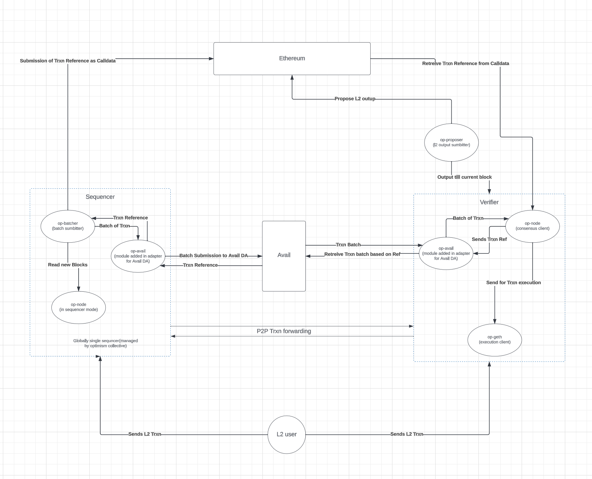

   
   
  
   
  <h3><a href="https://www.availproject.org/">Avail</a>: Data availability focused blockchain <a href="https://github.com/availproject/avail-op-stack-adapter">X</a> Low-cost and lightning-fast Ethereum L2 blockchain: <a href="https://optimism.io">Optimism</a></h3>
   

# Avail-OP-Stack-Adapter

### Avail-OP-Stack Adapter integrates the Avail Data Availability layer in Optimism’s OP Stack to create a more optimised and efficient Optimistic Rollup architecture. It is designed to minimise the cost of posting L2 transactions over the DA layer with a better data availability guarantee

## Contribution Guidelines

### Rules

Avail welcomes contributors from every background and skill level. Our mission is to build a community that's not only welcoming and friendly but also aligned with the best development practices. Interested in contributing to this project? Whether you've spotted an issue, have improvement ideas, or want to add new features, we'd love to have your input. Simply open a GitHub issue or submit a pull request to get started.

1. Before asking any questions regarding how the project works, please read through all the documentation and install the project on your own local machine to try it and understand how it works. Please ask your questions in open channels (Github and [Telegram](https://t.me/avail_uncharted/)).

2. To work on an issue, first, get approval from a maintainer or team member. You can request to be assigned by commenting on the issue in GitHub. This respects the efforts of others who may already be working on the same issue. Unapproved PRs may be declined.

3. When assigned to an issue, it's expected that you're ready to actively work on it. After assignment, please provide a draft PR or update within one week. If you encounter delays, communicate with us to maintain your assignment.

4. Got an idea or found a bug? Open an issue with the tags [New Feature] or [Bug]. Provide detailed information like reproduction steps (for bugs) or a basic feature proposal. The team will review and potentially assign you to it.

5. Start a draft PR early in your development process, even with incomplete changes. This allows us to track progress, provide timely reviews, and assist you. Expect feedback on your drafts periodically.

## What is Avail?

[Avail](https://www.availproject.org/) is a data availability focused blockchain. Its blocks are designed to provide secure, decentralized and low-cost blockspace for the data availability needs of other blockchains. It is built to meet the needs of next-generation, trust-minimized applications and sovereign rollups. Avail's strengths lie in its innovative security approach, which allows light clients to easily verify data availability through sampling over a peer-to-peer network. Avail’s modular approach simplifies blockchain integration for developers, as they no longer need to worry about validator sets or tokenomics. With Avail's unparalleled data availability interface and powerful security capabilities, developers can create zero-knowledge or fraud-proof-based blockchain applications with greater efficiency and ease.

At its core, Avail prioritizes ordering and publishing transactions while enabling users to verify the availability of block data without needing to download entire blocks. Avail's data-agnostic nature is one of its defining features. It supports various execution environments, including EVM, WASM, and custom new runtimes, offering a versatile foundation for diverse blockchain applications.

## What is Optimism?

[Optimism](https://www.optimism.io/) is a project dedicated to scaling Ethereum's technology and expanding its ability to coordinate people from across the world to build effective decentralized economies and governance systems. The [Optimism Collective](https://app.optimism.io/announcement) builds open-source software for running L2 blockchains and aims to address key governance and economic challenges in the wider cryptocurrency ecosystem. Optimism operates on the principle of **impact=profit**, the idea that individuals who positively impact the Collective should be proportionally rewarded with profit. **Change the incentives and you change the world.**

In this repository, you'll find numerous core components of the OP Stack, the decentralized software stack maintained by the Optimism Collective that powers Optimism and forms the backbone of blockchains like [OP Mainnet](https://explorer.optimism.io/) and [Base](https://base.org). Designed to be "aggressively open source," the OP Stack encourages you to explore, modify, extend, and test the code as needed. Although not all elements of the OP Stack are contained here, many of its essential components can be found within this repository. By collaborating on free, open software and shared standards, the Optimism Collective aims to prevent siloed software development and rapidly accelerate the development of the Ethereum ecosystem. Come contribute, build the future, and redefine power, together.

## Integration of Avail DA layer in OP-Stack

OP Stack chain is derived from the Data Availability Layer, the Data Availability module(s) used have a significant impact on the security model of a system. For example, if a certain piece of data can no longer be retrieved from the Data Availability Layer, it may not be possible to sync the chain.

In ORUs, **Sequencer** has the responsibility to submit L2 transactions to a **data availability provider**. Ethereum DA is currently the used Data Availability module for the OP Stack.

In `Avail-OP-Stack-Adapter`, the Data Availability layer is switched from Ethereum to Avail in OP Stack modular blockchain architecture to create the optimistic rollup.

1. **Sequencer** posts L2 transaction data on Avail DA and submits the data commitment to Ethereum as `callData`.
2. **Verifier and Rollup nodes** can derive the chain using the data commitment from `callData` to read the L2 transaction data from Avail.

## Working of Avail-OP-Stack-Adapter

There are few changes being made in the workflow compared to **`op-stack`** with Ethereum as Data Availability Layer

1. **`op-avail`** is the module added to integrate the Avail DA with **`op-stack`**.
2. Here, **`op-batcher`** submits the batch of transactions on Avail DA using the **`op-avail`** and gets the data commitment in the return, which is again submitted over Ethereum as `callData` on BatchInbox address.
3. To derive the chain **`op-node`**, first query the data commitment from Ethereum `callData` and then fetch the L2 transaction data through **`op-avail`**.

Here **`op-node`**, **`op-geth`**, **`op-batcher`** and **`op-proposer`** are the software components of op-stack to learn more about it, follow [**op-stack**](https://github.com/ethereum-optimism/optimism/tree/develop)

   
   
  
   

## Benefits

ORUs faced with growth challenges due to constrained blockspace and prohibitive costs, have now come to recognize that a scalable [data availability](https://availproject.github.io/?ref=blog.availproject.org) layer is crucial for effectively scaling blockchains. They have come to realize the need for a cost-effective base layer with expandable block space

Avail is a highly tuned data availability base layer which can provide raw blockspace for next-generation, trust minimized applications and blockchains. it ensures the modular blockchain ecosystem can access secure, affordable and highly available block space for transaction data unlocking significant scaling potential for the industry.

### Cost

When inspecting L1 transactions for Ethereum Rollups, we can see the major bottleneck which represents up to 90% of their costs is transaction data. In fact, this is the largest cost item for Ethereum Rollups as [most of their revenues](https://twitter.com/0xKofi/status/1666844191194853383?ref=blog.availproject.org) go towards paying an L1 to publish transaction data.

Ethereum is the most expensive solution in relation to congestion and demand. Even with EIP-4844 Ethereum will still be costly as it provides only a one-time increase in blockspace. DACs are the cheapest, but this comes at the cost of adopting a more centralized approach.

Avail is a Data Availablity Sampling based DA provider with no congestion, Using Avail as DA layer will reduce the cost of posting L2 transactional data over L1 layer.

### High Data Availability

pre EIP 4844 ethereum has no support of DAS and fraud proof and with low calldata space, where as in Avail

Avail’s light client network ensures high availability of data through Data Availability Sampling. with validity proof mechanism and high space compared to ethereum’s calldata

## Documentation

- If you want to build on top of Avail, refer to the [Avail developers](https://www.availproject.org/developer)
- If you want to build your own avail-optimism blockchain, refer to the [Avail Optimism(Optimium)](https://docs.availproject.org/category/optimium/)
- If you want to learn more about OP-Stack and Optimsim, check out the [OP Stack](https://stack.optimism.io/) and [Optimism](https://www.optimism.io/)

## Community

### Optimism

General discussion happens most frequently on the [Optimism discord](https://discord.gg/optimism).
Governance discussion can also be found on the [Optimism Governance Forum](https://gov.optimism.io/).

### Avail

General discussion happens most frequently on the [Avail discord](https://discord.gg/y6fHnxZQX8).
Other discussion can also be found on the [Avail Forum](https://forum.availproject.org/).

## Contributing

Read through [CONTRIBUTING.md](./CONTRIBUTING.md) for a general overview of the contributing process for this repository.
Use the [Developer Quick Start](./CONTRIBUTING.md#development-quick-start) to get your development environment set up to start working on the avail-op-stack-adapter Monorepo.
Then check out the list of [Good First Issues](https://github.com/availproject/avail-op-stack-adapter/contribute) to find something fun to work on!

## Directory Structure

<pre>
├── <a href="./packages">packages</a>
│   ├── <a href="./packages/common-ts">common-ts</a>: Common tools for building apps in TypeScript
│   ├── <a href="./packages/contracts-bedrock">contracts-bedrock</a>: Bedrock smart contracts.
│   ├── <a href="./packages/contracts-periphery">contracts-periphery</a>: Peripheral contracts for avail-op-stack-adapter
│   ├── <a href="./packages/core-utils">core-utils</a>: Low-level utilities that make building avail-op-stack-adapter easier
│   ├── <a href="./packages/chain-mon">chain-mon</a>: Chain monitoring services
│   ├── <a href="./packages/fault-detector">fault-detector</a>: Service for detecting Sequencer faults
│   ├── <a href="./packages/replica-healthcheck">replica-healthcheck</a>: Service for monitoring the health of a replica node
│   └── <a href="./packages/sdk">sdk</a>: provides a set of tools for interacting with avail-op-stack-adapter
├── <a href="./op-avail">op-avail</a>: Avail module to interact with Avail DA
├── <a href="./op-bindings">op-bindings</a>: Go bindings for Bedrock smart contracts.
├── <a href="./op-batcher">op-batcher</a>: L2-Batch Submitter, submits bundles of batches to L1
├── <a href="./op-bootnode">op-bootnode</a>: Standalone op-node discovery bootnode
├── <a href="./op-chain-ops">op-chain-ops</a>: State surgery utilities
├── <a href="./op-challenger">op-challenger</a>: Dispute game challenge agent
├── <a href="./op-e2e">op-e2e</a>: End-to-End testing of all bedrock components in Go
├── <a href="./op-exporter">op-exporter</a>: Prometheus exporter client
├── <a href="./op-heartbeat">op-heartbeat</a>: Heartbeat monitor service
├── <a href="./op-node">op-node</a>: rollup consensus-layer client
├── <a href="./op-program">op-program</a>: Fault proof program
├── <a href="./op-proposer">op-proposer</a>: L2-Output Submitter, submits proposals to L1
├── <a href="./op-service">op-service</a>: Common codebase utilities
├── <a href="./op-signer">op-signer</a>: Client signer
├── <a href="./op-wheel">op-wheel</a>: Database utilities
├── <a href="./ops-bedrock">ops-bedrock</a>: Bedrock devnet work
├── <a href="./proxyd">proxyd</a>: Configurable RPC request router and proxy
└── <a href="./specs">specs</a>: Specs of the rollup starting at the Bedrock upgrade
</pre>

## Branching Model

### Active Branches

| Branch          | Status                                                                           |
| --------------- | -------------------------------------------------------------------------------- |
| [avail-master](hhttps://github.com/availproject/avail-op-stack-adapter/tree/avail-master/)                   | Accepts PRs from `avail-develop` when intending to deploy to production.                  |
| [avail-develop](https://github.com/availproject/avail-op-stack-adapter/tree/avail-develop/)                 | Accepts PRs that are successfully running without fails.                    |

### Overview

This repository generally follows [this Git branching model](https://nvie.com/posts/a-successful-git-branching-model/).
Please read the linked post if you're planning to make frequent PRs into this repository.

### Production branch

The production branch is `avail-master`.
The `avail-master` branch contains the code for latest "stable" releases.
Updates from `avail-master` **always** come from the `avail-develop` branch.

### Development branch

The primary development branch is [`avail-develop`](https://github.com/availproject/avail-op-stack-adapter/tree/avail-develop/).
`avail-develop` contains the most up-to-date software that remains backwards compatible with the latest experimental.
If you're making a backwards compatible change, please direct your pull request towards `avail-develop`.

## License

All other files within this repository are licensed under the [MIT License](https://github.com/availproject/avail-op-stack-adapter/blob/avail-master/LICENSE) unless stated otherwise.
